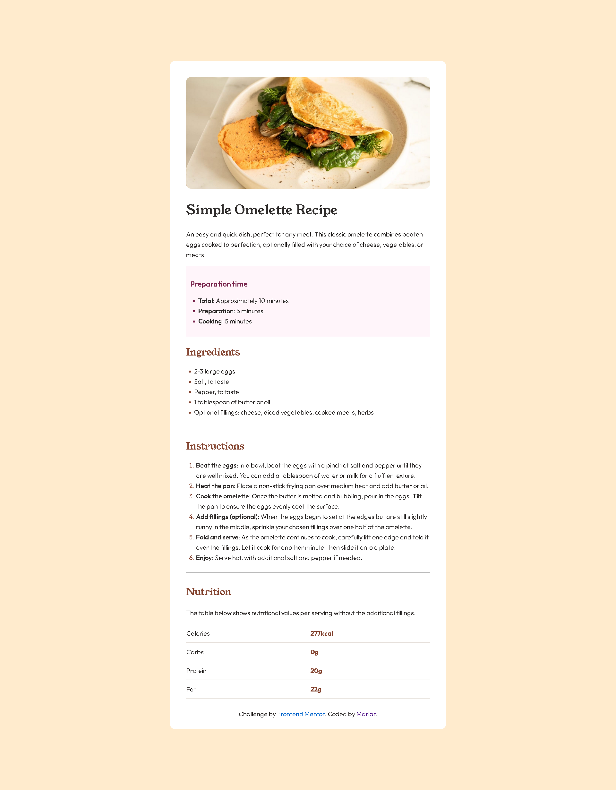
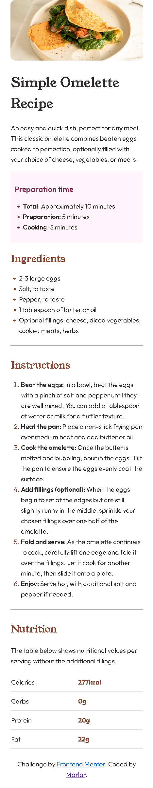

# Frontend Mentor - Recipe page solution

This is a solution to the [Recipe page challenge on Frontend Mentor](https://www.frontendmentor.io/challenges/recipe-page-KiTsR8QQKm). Frontend Mentor challenges help you improve your coding skills by building realistic projects. 

## Table of contents

- [Overview](#overview)
  - [The challenge](#the-challenge)
  - [Screenshot](#screenshot)
  - [Links](#links)
- [My process](#my-process)
  - [Built with](#built-with)
  - [What I learned](#what-i-learned)
  - [Continued development](#continued-development)
  - [Useful resources](#useful-resources)
- [Author](#author)

## Overview

### Screenshot





### Links

- Solution URL: [Solution URL](https://www.frontendmentor.io/solutions/responsive-recipe-page-using-css-flexbox-and-html-responsive-sTt3ONBQgd)
- Live Site URL: [Live site URL](https://marlar-tz.github.io/Responsive_Recipe_Page/)

## My process

### Built with

- HTML responsive
- CSS Flexbox
- Mobile-first workflow

### What I learned

In this challenge , I learnt about CSS FlexBox and HTML reponsive webdesign.Below, I provide some code samples which I want to highlight for this challenge. 

```html
 <div class="flex-container">
  <div> </div>
  <div> </div>
  <div> </div>
</div> 
```
```css
.flex-container {
    display: flex;
    flex-direction: column;
    margin-top: 10%;
    margin-bottom: 10%;
}
.flex-container>div {
    width: 40%;
    justify-content: center;
    align-items: center;
    background-color: white;
    padding: 0px 40px;
    align-self: center;
    font-size: 16px;
    font-family: outfit;
    font-weight: 350;
}

.flex-container>.attribution {
    padding-bottom: 25px;
    text-align: center;
}

.attribution {
    border-bottom-left-radius: 12px;
    border-bottom-right-radius: 12px;

}
```

### Continued development

In the future , I want to continue focusing on reponsive web design development such as HTML Responsive , Bootstrap ,etc.


### Useful resources

- [HTML Responsive](https://www.w3schools.com/html/html_responsive.asp) - This helped me for responsive web design.
- [CSS Flexbox](https://www.w3schools.com/css/css3_flexbox.asp) - This helped me to design flexible responsive layout structure.


## Author

- Frontend Mentor - [@Marlar](https://www.frontendmentor.io/profile/marlar-tz)


